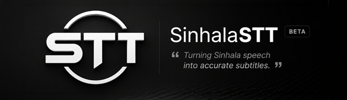
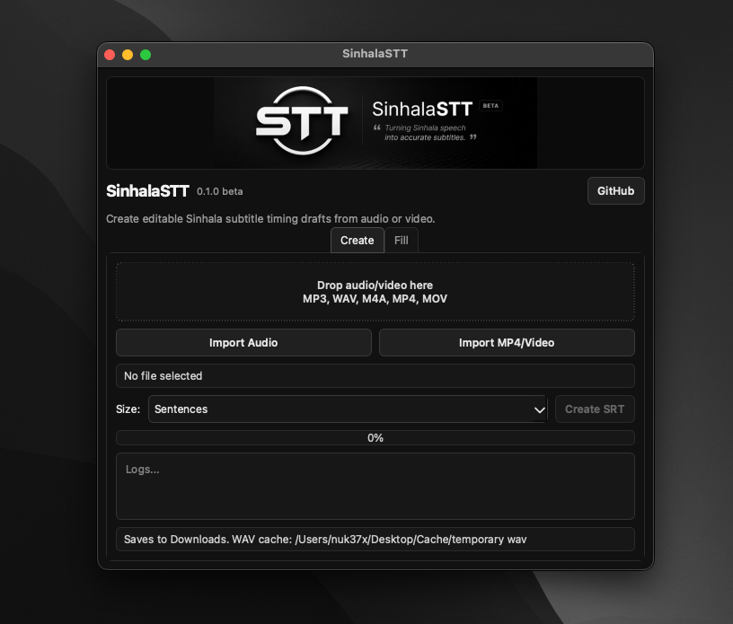

# SinhalaSTT



**SinhalaSTT 0.1.0 beta** is a local/offline macOS tool for creating editable Sinhala subtitle timing drafts from audio or video.



_SinhalaSTT 0.1.0 beta desktop app_

It does **not** transcribe Sinhala automatically. Instead, it creates timestamp placeholder `.srt` files that you can fill with Sinhala text from manual typing, Helakuru, or another source.

```text
audio/video file -> detect speech/silence -> placeholder SRT -> paste Sinhala lines -> filled SRT
```

## Features

- Import audio or video files.
- Drag and drop files into the app.
- Create `.srt` placeholder timing blocks.
- Choose placeholder size: sentences, 1 word, 2 words, or 3 words.
- Paste Sinhala text line-by-line into matching subtitle blocks.
- Export filled `.srt` files.
- Runs locally on macOS.

## Supported Inputs

```text
MP3, WAV, M4A, AAC, FLAC, AIFF, MP4, MOV, M4V, MKV, AVI, WEBM
```

## macOS App

The packaged app is named:

```text
SinhalaSTT.app
```

Generated placeholder and filled `.srt` files save to:

```text
Downloads/
```

Temporary converted WAV files save to:

```text
Desktop/Cache/temporary wav/
```

## How To Use

1. Open `SinhalaSTT`.
2. Drag an audio/video file into the app, or use `Import Audio` / `Import MP4/Video`.
3. Choose a placeholder size.
4. Click `Create SRT`.
5. Paste Sinhala lines in the `Fill` tab.
6. Click `Create Filled SRT`.

Blank pasted lines skip matching placeholders.

Example:

```text
මම අද
කඩේට

ඇත්තටම
```

Line 1 replaces subtitle 1, line 2 replaces subtitle 2, line 3 stays unchanged, and line 4 replaces subtitle 4.

## Important Limit

SinhalaSTT does not understand speech or language content. It estimates timing from audio volume and silence.

This means:

- sentence mode is usually the easiest to edit
- word modes are approximate
- background music/noise may confuse timing
- fast speech may group multiple real words together
- long speech without pauses may become a long block

Use it as a subtitle editing scaffold, then manually correct the final `.srt`.

## Developer Setup

Install FFmpeg and Python dependencies:

```bash
brew install ffmpeg
python3 -m venv .venv
source .venv/bin/activate
pip install -r requirements.txt
```

Run the UI:

```bash
python scripts/ui.py
```

Run the terminal placeholder generator:

```bash
python scripts/transcribe.py input/example.mp3 --mode sentence
python scripts/transcribe.py input/example.mp4 --mode 1
```

## Build macOS App

Install build dependency:

```bash
pip install pyinstaller
```

Build the app:

```bash
pyinstaller --noconfirm --windowed \
  --name "SinhalaSTT" \
  --icon "assets/SinhalaSTT.icns" \
  --add-data "assets:assets" \
  --paths scripts \
  scripts/ui.py
```

The app will be created in:

```text
dist/SinhalaSTT.app
```

## Distribution

The first beta package is an unsigned macOS DMG:

```text
SinhalaSTT-0.1.0-beta-macOS-arm64.dmg
```

Because it is unsigned and not notarized, macOS may require users to right-click the app and choose `Open` the first time.
